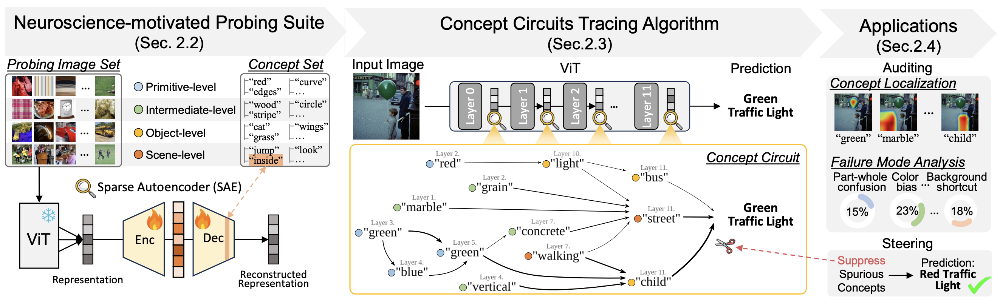
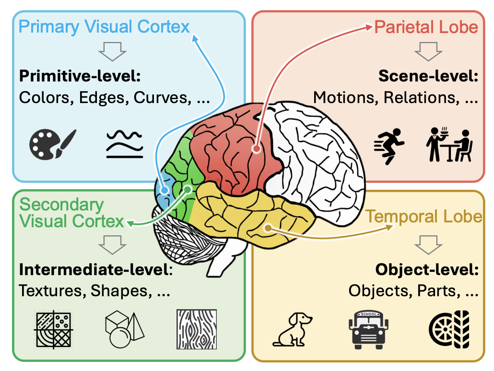
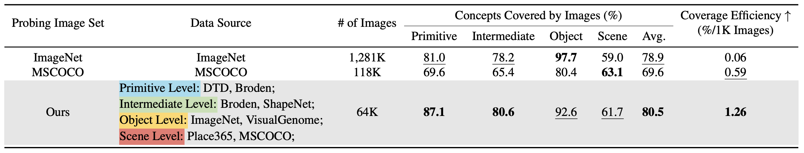

# Inside the Visual Mind: Neuroscience-Motivated Concept Circuits for Interpreting and Steering Vision Transformers (ICML 2026)

[[Paper](https://tangli0305.github.io/)] [[Code](https://github.com/deep-real/ViSAE)] [[Video](https://tangli0305.github.io/)] [[DeepREAL Lab](https://deep-real.github.io/)]


This repository holds the Pytorch implementation of [Inside the Visual Mind: Neuroscience-Motivated Concept Circuits for Interpreting and Steering Vision Transformers](https://tangli0305.github.io/) by [Tang Li](https://tangli0305.github.io/), [Yanlin Chen](https://deep-real.github.io/people.html), [Mengmeng Ma](https://mengmenm.top/), and [Xi Peng](https://deep-real.github.io/dr_xipeng.html).
If you find our paper and code useful in your research, please consider citing:

```
@inproceedings{li2026visae,
 title={Inside the Visual Mind: Neuroscience-Motivated Concept Circuits for Interpreting and Steering Vision Transformers},
 author={Li, Tang and Chen, Yanlin and Ma, Mengmeng and Peng, Xi},
 booktitle={Proceedings of the International Conference on Machine Learning (ICML)},
 year={2026}
}
```


## Overview

To understand the inner workings of Vision Transformers (ViTs), we developed a mechanistic interpretability toolbox - ViSAE. It consists of a neuroscience-motivated probing suite, a concept circuit tracing algorithm, and a series of applications for ViT auditing and steering.



## 1. Neuroscience-Motivated Probing Suite (Images + Concepts)
Our probing suite mirrors the hierarchy of human visual cortex, covering the full spectrum of visual processing.

<!--  -->


Our probing suite consists of 64K images for SAE training, and 16K corresponding concepts for SAE feature interpretation. Our probing images outperforms common ImageNet baseline by 20x in terms of concept coverage efficiency.




### Download
- Probing Image Set: [Huggingface](https://huggingface.co/datasets/deeprealaiml/ViSAE/tree/main)
- Concept Set: [Github](https://github.com/deep-real/ViSAE/blob/main/concept_set/ours_16K.txt)


## 2. Concept Circuit Tracing Algorithm
Before run our algorithm, you need to extract the intermediate representations from each layer of your ViT using:
```
/activation_store.py
```

### Top-down Concept Reading
Train SAEs for each ViT layer using:
```
/train_batch_topk.py
```
Then use CLIP embedding space to map SAE learned features to our concepts:
```
/dissect_analysis_CLS+Image_top-128.ipynb
```

### Bottom-up Circuit Tracing
Using our causal intervention method to trace the interactions between concepts:
```
/causal_tracing_cls_img_general_unified.ipynb
```

## Acknowledgement
Part of our code is borrowed from the following repositories.

- [dictionary learning](https://github.com/saprmarks/dictionary_learning/tree/main)

We thank to the authors for releasing their codes. Please also consider citing their works.